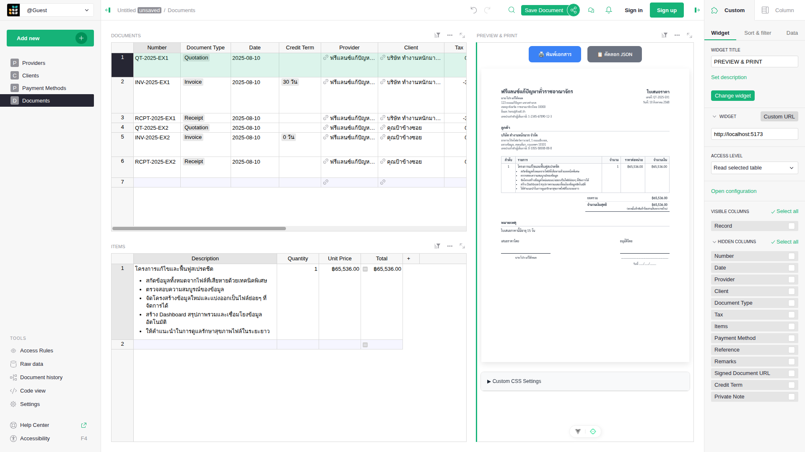

# bizdocgen

A custom [Grist widget](https://support.getgrist.com/widget-custom/) for generating these type of documents:

- **Quotation** (ใบเสนอราคา)
- **Invoice** (ใบแจ้งหนี้)
- **Receipt** (ใบเสร็จรับเงิน)



## Set up

1. Download the Grist template file: [template.grist](template.grist)
2. Open the template in your Grist account.

## Technology Stack

- **Frontend**: Vue 3 with Composition API + TypeScript
- **Build Tool**: Vite
- **Package Manager**: Bun

## Development

Set up [VSCode](https://code.visualstudio.com/) + [Volar](https://marketplace.visualstudio.com/items?itemName=Vue.volar) (disable Vetur)

```bash
# Clone the repository
git clone https://github.com/dtinth/TypeScriptAccount.git
cd TypeScriptAccount

# Install dependencies
bun install

# Start development server
bun dev
```

## License

MIT

## Related Documentation

- [Vite Configuration Reference](https://vite.dev/config/)
- [Vue 3 Documentation](https://vuejs.org/)
- [TypeScript Documentation](https://www.typescriptlang.org/)
- [Zod Validation](https://zod.dev/)
- [Grist Custom Widgets Guide](https://support.getgrist.com/widget-custom/)
- [Grist Widget API Reference](https://support.getgrist.com/widget-custom-api/)
- [Grist Templates](https://templates.getgrist.com/)
